# MyZubster Comic — Ecosystem Visual Atlas

Status: `PLANNING / EVIDENCE-LINKED`

This atlas integrates the public visual ecosystem into the MyZubster comic without duplicating canonical photographic evidence. Real photographs remain in `MyZubster-Ecosystem/MyZubster-Photos`; comic artwork remains in `MyZubster-Visual`.

## Editorial rule

- `REAL_EVIDENCE`: public photographs from MyZubster-Photos after privacy/EXIF review.
- `CANON_INTERPRETATION`: comic panels inspired by verified evidence.
- `CONCEPT_ONLY`: visual concepts not asserted as real events.
- Never turn a fictional scene, payment, deployment, partnership, identity claim, or bounty outcome into a factual claim without independent evidence.

## External contributor visual — Metasploit Sentinel

Contributor: `@Aming9303`
Source: merged PR #12.
Status: `CONCEPT_ONLY / PROPOSED`.

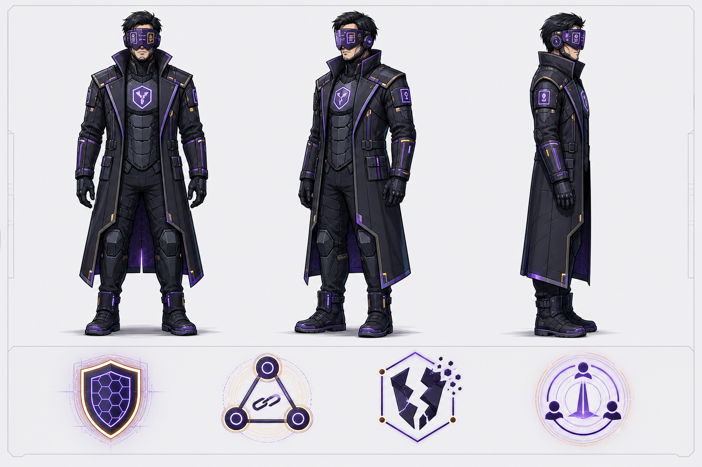

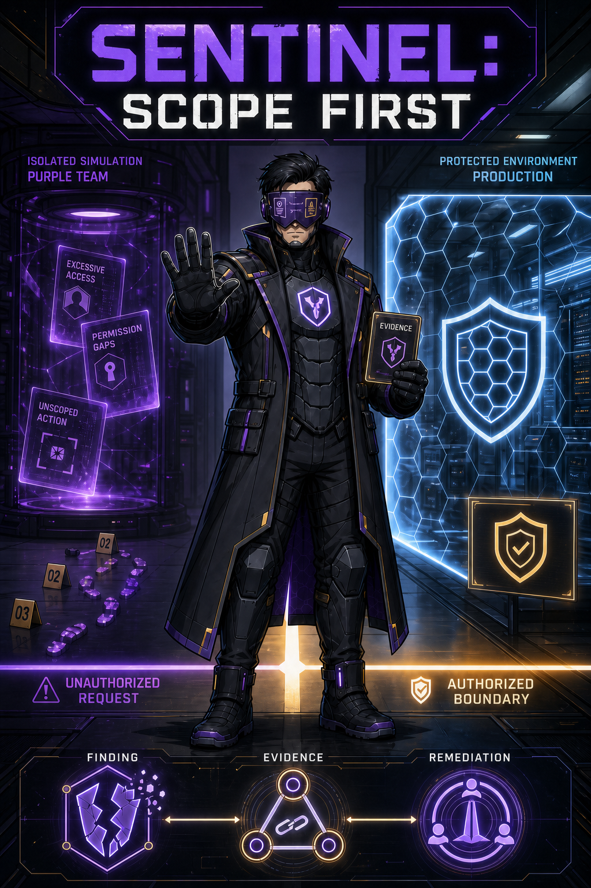

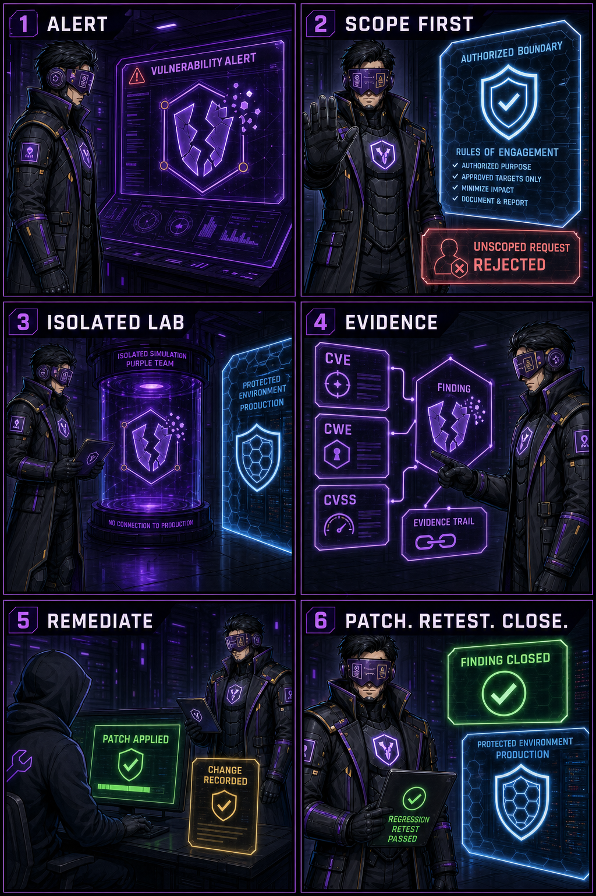

Narrative use: Sentinel can appear as a defensive cyberpunk guardian representing authorization, isolated validation, evidence, remediation and retest. It must not be presented as proof of a real security engagement or autonomous production testing.

## Existing MyZubster comic visuals

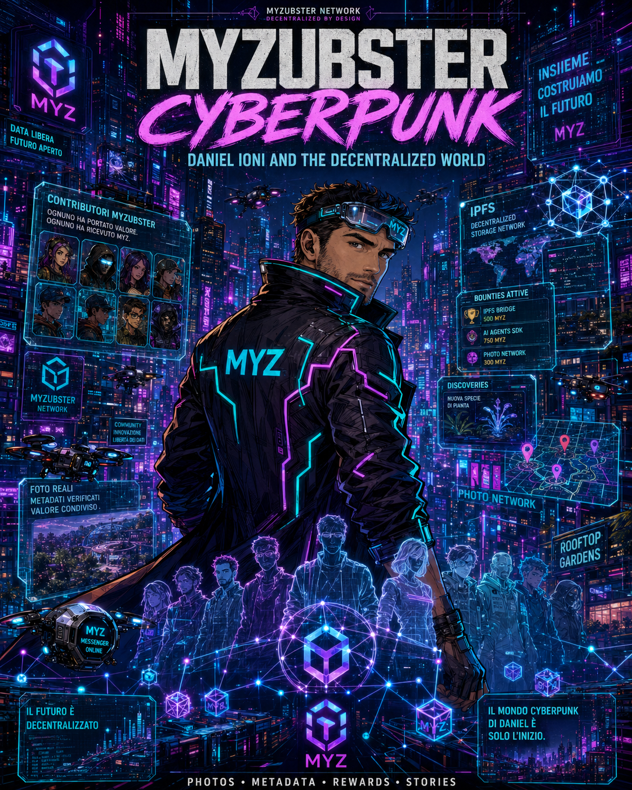

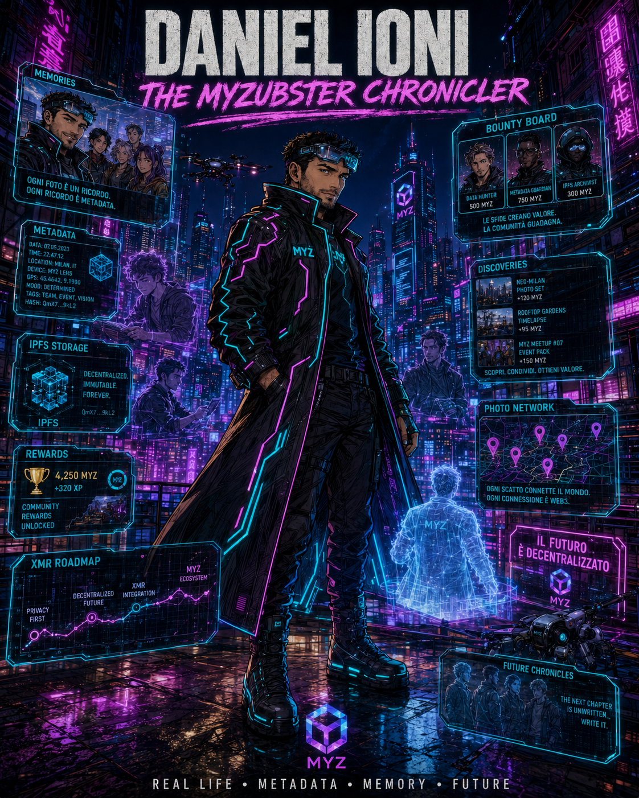

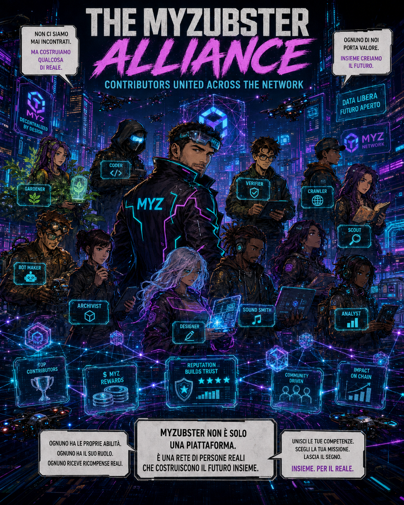

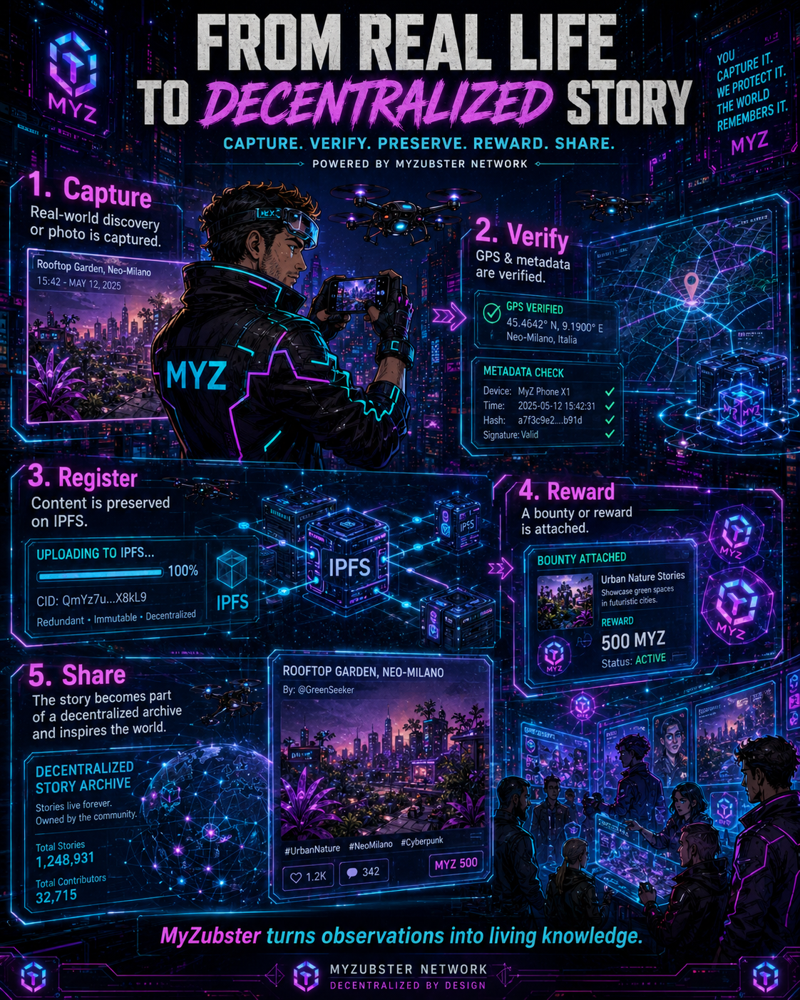

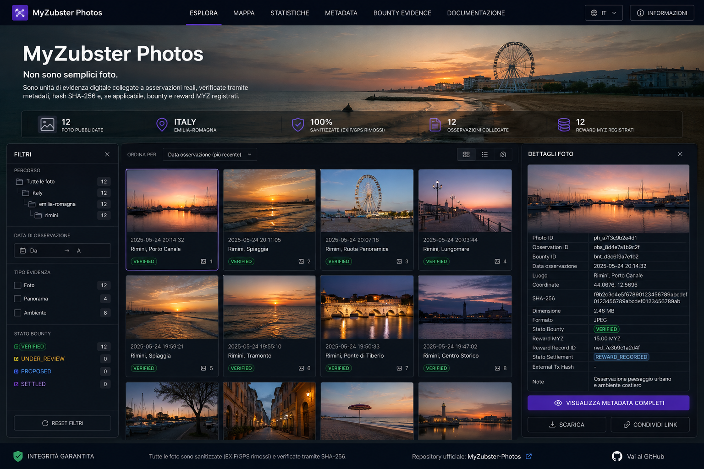

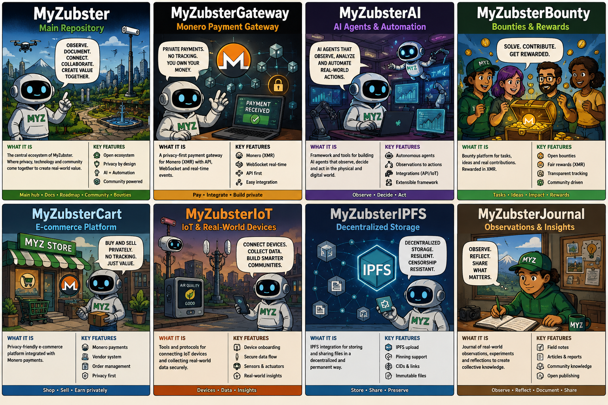

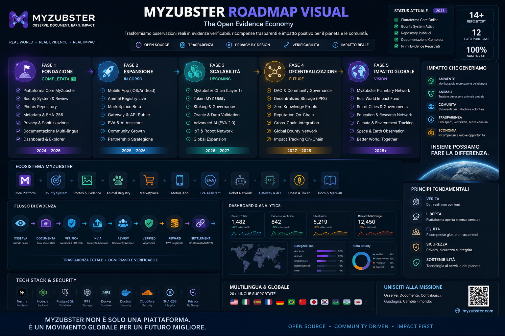

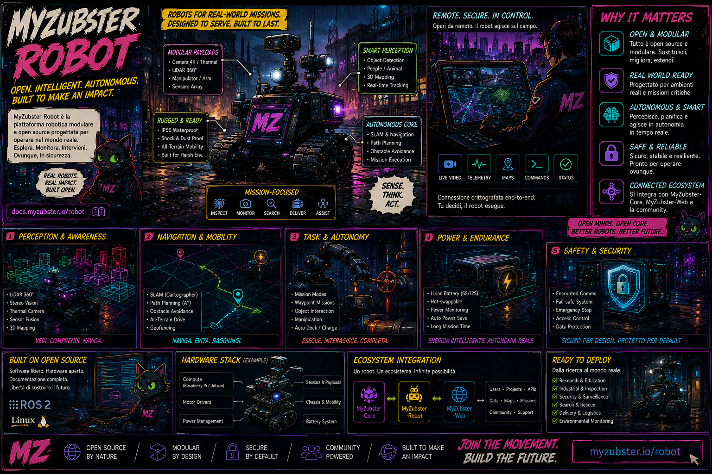

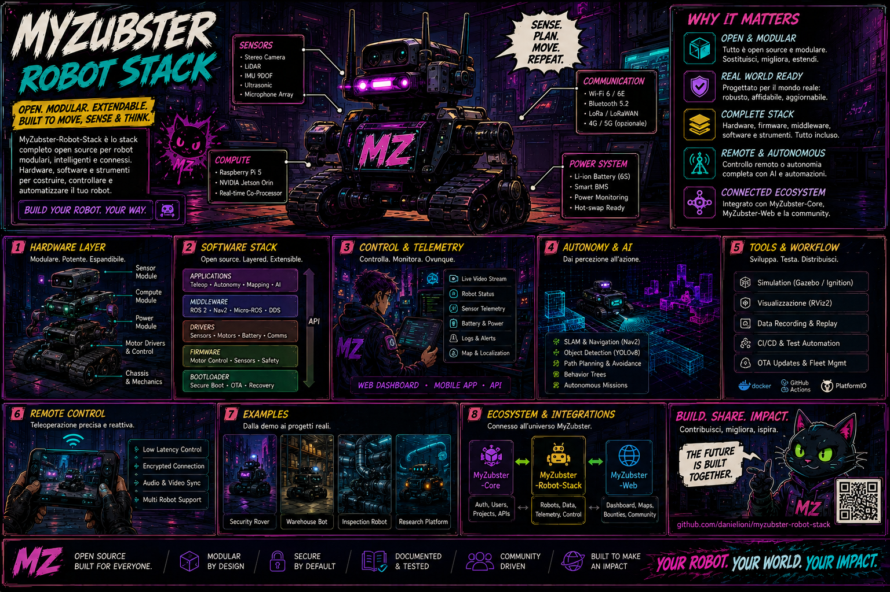

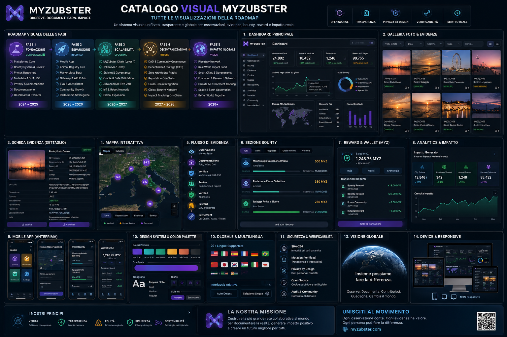

## Ecosystem bots

The repository contains dedicated visual assets under `assets/bots/`, including Clowbot, Crawler Bot, EVA Ioni, GitHub Bounty Bot, MyZubster AI Bot, Notification Bot, Space Station AI, Telegram Bot and Verifier AI. These assets form the bot cast for the comic universe and should be introduced according to documented project roles rather than invented production capabilities.

## Canonical public photo stream

Source repository: `MyZubster-Ecosystem/MyZubster-Photos`.

The public photographic archive is the evidence layer for the comic. Current repository material includes real-world categories and geographic collections such as gardens/plants, civic locations, landmarks, services, sky, squares and streets. The photo catalog also defines ecosystem categories for plants, gardens, urban, nature, heritage, robots, observations and bounties.

Rather than copying every photograph into this repository, the comic treats the full public `MyZubster-Photos` tree as its canonical photo stream. This keeps one source of truth and allows new approved ecosystem photographs to enter the comic pipeline without creating duplicate evidence files.

### Evidence gallery entry points

- Repository: https://github.com/MyZubster-Ecosystem/MyZubster-Photos
- Rimini archive: https://github.com/MyZubster-Ecosystem/MyZubster-Photos/tree/main/photos/italy/emilia-romagna/rimini
- Garden archive: https://github.com/MyZubster-Ecosystem/MyZubster-Photos/tree/main/photos/italy/emilia-romagna/rimini/gardens
- Comic visuals and covers: https://github.com/MyZubster-Ecosystem/MyZubster-Photos/tree/main/04%20Comic%20Visuals%20%26%20Covers

## Story integration

The visual ecosystem is mapped into `Daniel // MyZubster: Origins` as follows:

1. **Before the Network** — real places, streets, civic and personal-source material only when publication-safe.
2. **The First Signal** — gardens, plants, observations and first documented evidence.
3. **Builders' Solitude** — source-backed history plus existing Daniel visual language.
4. **Archive of Proof** — photographs, evidence dashboards, metadata, SHA-256 and verification imagery.
5. **Birth of the Bots** — the `assets/bots/` cast and approved character boards.
6. **Decentralized Memory** — repositories, evidence architecture, visual catalog, roadmap and Sentinel as a `CONCEPT_ONLY` defensive visual.

## Publication pipeline for MyZubster.com

`MyZubster-Photos → privacy/EXIF review → evidence link → story card → comic panel → editorial/technical QA → publication`

The website presentation should expose both layers: the comic interpretation and a clearly marked path back to the real evidence when one exists. This preserves the boundary between documentary material and cyberpunk storytelling while allowing the full ecosystem to participate visually.
